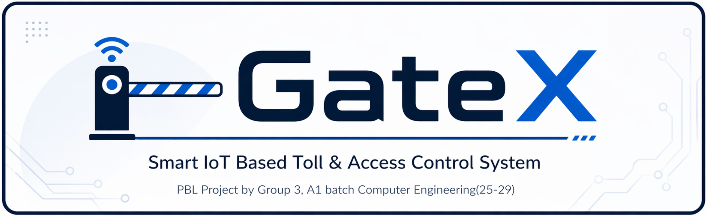

> **FY B.Tech (COMPS) | Semester II (2025–26) | K J Somaiya College of Engineering, Somaiya Vidyavihar University**

**[Project Slides](Group3_Sem2_PBL.pdf)**

---

## Overview

**GateX** is a low-cost, IoT-based smart toll and access control system designed under the **Smart City** theme. The current prototype automates vehicle detection, RFID-based vehicle authentication, barrier control, browser-based monitoring, and ESP32-CAM image capture within a budget of approximately ₹3000.

The system addresses the core problems of modern toll infrastructure: long queues, manual intervention, lack of real-time monitoring, and the inability to detect blacklisted or suspicious vehicles. GateX is designed to work reliably even offline and is scalable to small campuses, parking lots, and private communities.

---

## Features

- **RFID-based Vehicle Authentication** : Contactless identification using 13.56 MHz RFID tags
- **Automatic Barrier Control** : Servo motor gate opens/closes based on authentication result
- **UID-based Toll Mapping** : Predefined RFID cards are mapped to light, heavy, emergency, or blocked access states
- **Emergency Vehicle Priority** : Emergency vehicle cards are allowed through with free access
- **Vehicle Presence Detection** : IR sensor detects an approaching vehicle before the RFID step
- **Real-Time Web Dashboard** : Live monitoring, latest transaction data, and in-memory history via browser UI
- **ESP32-CAM Image Capture** : Separate camera module serves a capture page for vehicle images
- **Low-Cost Dual-ESP32 Architecture** : Main controller and camera module are split for simplicity and modularity

### Planned Next-Stage Extensions

- Digital wallet and cashless balance deduction
- Blacklist / suspicious vehicle database checks
- Additional safety sensors for smarter barrier closing
- Persistent cloud logging and richer analytics

---

## System Architecture

The project is split into two codebases running on two separate ESP32 boards:

### `ESP32_MAIN` - Main Control Unit

- Reads RFID tags via the **MFRC522 module** (SPI interface)
- Classifies the scanned UID into light, heavy, emergency, or blocked access
- Calculates the displayed toll amount from the UID mapping
- Controls the **SG90 servo motor** barrier gate
- Detects vehicle arrival via a single **IR sensor** in the current firmware
- Serves toll entry data via an **HTTP WebServer**
- Stores session history in RAM for display on the dashboard

The broader project plan also includes wallet logic, blacklist checks, LCD output, and richer status indication hardware, but those are not yet present in the current firmware.

### `ESP32CAM` - Camera Module

- Initializes the **OV2640 camera** hardware
- Runs a lightweight **HTTP web server**
- Captures vehicle images from its own browser UI
- Stores image history in browser local storage on the viewing device

### Working Flow

```
Vehicle Arrives → IR Sensor Detects Vehicle → RFID Tag Scanned
    → Vehicle Type & Toll Determined → Data Sent to Web Dashboard
    → Gate Opens / Closes via Servo Motor
    → ESP32-CAM Can Capture Vehicle Image from Its Web UI
```

---

## Component Role in Project

| Component                   | Role                                          |
| --------------------------- | --------------------------------------------- |
| ESP32-CAM (OV2640)          | Microcontroller + Camera + Wi-Fi + Web Server |
| RFID Module (MFRC522)       | Vehicle identification via SPI                |
| Servo Motor (SG90)          | Barrier gate control (GPIO 25 on `ESP32_MAIN`) |
| IR Obstacle Sensor          | Vehicle presence detection (GPIO 27 on `ESP32_MAIN`) |
| LED Indicators (R/G/Y)      | Planned status indication hardware            |
| 16×2 LCD                    | Planned on-site status display               |
| Web Dashboard (HTML/CSS/JS) | Admin monitoring and history                  |
| Firebase / Cloud DB         | Planned logging and wallet management         |
| 5V USB / Power Bank         | Power supply                                  |

---

## Hardware Requirements

| Component                   | Specification        | Qty     | Approx. Cost (₹) |
| --------------------------- | -------------------- | ------- | ---------------- |
| ESP32 DevKit V1             | ESP-WROOM-32, 30-pin | 1       | 350              |
| ESP32-CAM with OV2640       | Camera module        | 1       | 550              |
| ESP32-CAM-MB USB Programmer | —                    | 1       | 150              |
| RC522 RFID Reader           | 13.56 MHz            | 1       | 150              |
| RFID Cards/Tags             | 13.56 MHz            | 4       | 60               |
| IR Obstacle Sensor          | —                    | 2       | 60               |
| Servo Motor SG90            | Barrier gate         | 1       | 100              |
| HX711 Amplifier             | Weight sensing       | 1       | —                |
| 16×2 LCD Display            | —                    | 1       | 150              |
| LEDs (R, G, Y)              | —                    | 6       | 6                |
| 220 Ω Resistors             | —                    | 15      | 15               |
| LDR Module                  | —                    | 1       | 55               |
| Breadboard                  | —                    | 1       | 60               |
| Jumper Wires                | —                    | 2 packs | 100              |
| Push Button (4-pin)         | —                    | 2       | 4                |
| 5V 2A Power Adapter         | —                    | 1       | 130              |
| Cardboard / Foam Board      | Gate model           | —       | —                |
| **Total**                   |                      |         | **~₹2000 (approx)** |

---

## Software Requirements

- **Arduino IDE** with ESP32 board support package
- **ESP32-CAM** camera libraries
- **MFRC522** RFID library
- **HX711** load cell library
- **Servo** motor library
- **LiquidCrystal** / LCD library
- **Wi-Fi** library (ESP32)
- **Firebase** / cloud database (logging & digital wallet)
- **Embedded C/C++** firmware
- **Web Dashboard** — HTML, CSS, JavaScript

---

## Pin Configuration

The following pin mapping matches the current firmware in `ESP32_MAIN/ESP32_MAIN.ino` and `ESP32CAM/ESP32CAM.ino`.

### `ESP32_MAIN` - Main Control Unit

| Signal              | GPIO |
| ------------------- | ---- |
| RFID SDA / SS       | 5    |
| RFID SCK            | 18   |
| RFID MISO           | 19   |
| RFID MOSI           | 23   |
| RFID RST            | 4    |
| IR Sensor (`IR1`)   | 27   |
| Servo Signal        | 25   |

### `ESP32-CAM` - OV2640 Camera Pins

| Camera Signal | GPIO |
| ------------- | ---- |
| PWDN          | 32   |
| RESET         | -1   |
| XCLK          | 0    |
| SIOD          | 26   |
| SIOC          | 27   |
| Y9            | 35   |
| Y8            | 34   |
| Y7            | 39   |
| Y6            | 36   |
| Y5            | 21   |
| Y4            | 19   |
| Y3            | 18   |
| Y2            | 5    |
| VSYNC         | 25   |
| HREF          | 23   |
| PCLK          | 22   |

---

## Setup & Usage

1. **Set WiFi credentials** - Update `ssid` and `password` in both `ESP32CAM/ESP32CAM.ino` and `ESP32_MAIN/ESP32_MAIN.ino`.
2. **Flash the camera firmware** - Upload `ESP32CAM` code to the ESP32-CAM board.
3. **Note the camera IP address** - On boot, the ESP32-CAM prints its local IP to the Serial Monitor.
4. **Flash the main firmware** - Upload `ESP32_MAIN` code to the primary ESP32 DevKit.
5. **Connect to the same WiFi** - Both boards must be on the same network.
6. **Operate the current prototype:**
   - Vehicle approaches → the IR sensor on GPIO 27 detects the vehicle
   - Vehicle scans RFID card on the RC522 reader
   - If authorized: the servo on GPIO 25 opens the barrier, the dashboard updates, and the gate closes after a fixed delay
   - Open the ESP32-CAM page separately to capture vehicle images from its web UI
7. **Monitor** - Open the main ESP32 web dashboard in any browser on the same network

---

## Results

All primary objectives were achieved in the working prototype:

| Objective                       | Notes                                                     |
| ------------------------------- | --------------------------------------------------------- |
| Vehicle detection via IR sensor | Minor false triggers possible under strong ambient light  |
| RFID-based identification       | Highly accurate; depends on card placement & reader range |
| Automatic gate (servo)          | Slight delay possible due to processing time              |
| Dynamic toll calculation        | Accurate for predefined vehicle categories                |
| Real-time web dashboard         | Near real-time; depends on WiFi stability                 |
| Vehicle history logging         | Stored in server memory; resets on restart                |
| Camera-based vehicle capture    | Functional; image quality varies with lighting            |

---

## Team

| Name            | Roll No.    |
| --------------- | ----------- |
| Md. Areeb Anwar | 16010125012 |
| Arav Arun       | 16010125013 |
| Eshika Arya     | 16010125014 |
| Mohammed Attar  | 16010125015 |
| Omkar Avhad     | 16010125016 |
